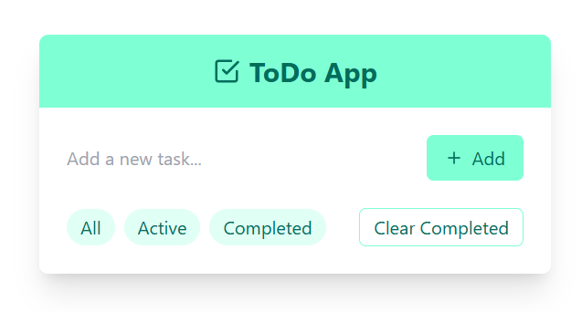
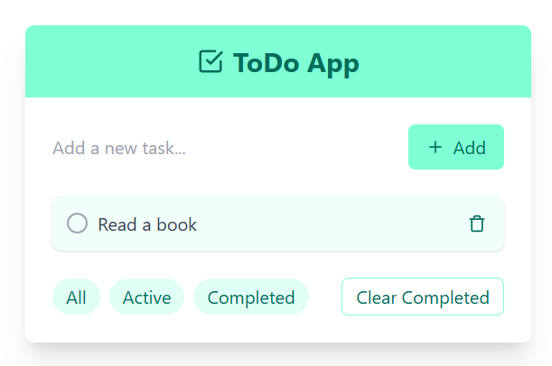
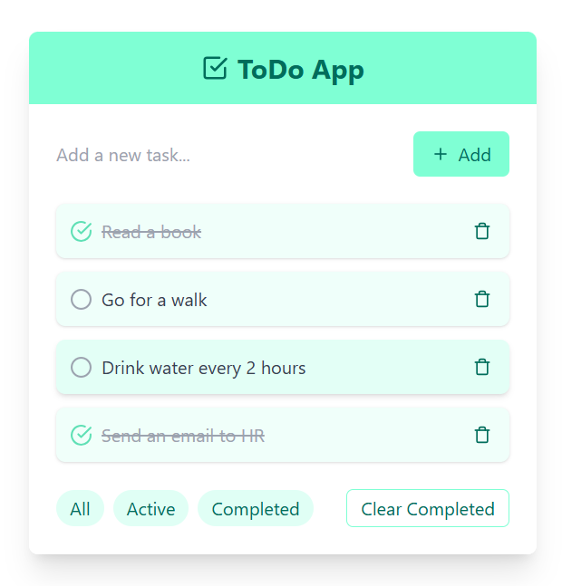
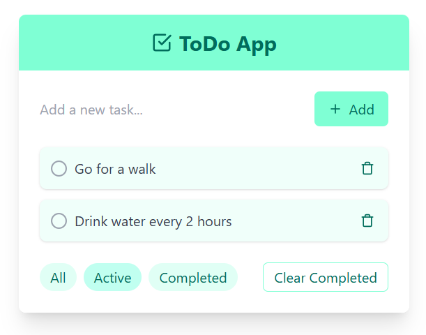

# ToDo App

A simple, elegant ToDo application built with Python (Flask) and HTML/JavaScript.



## Features

- Add new tasks
- Mark tasks as complete/incomplete
- Delete individual tasks
- Filter tasks (All, Active, Completed)
- Clear all completed tasks
- Responsive design for various screen sizes

## Screenshots

### Adding a New Task


### Completed Tasks


### Filtered View


## Technologies Used

- Backend: Python with Flask
- Frontend: HTML, CSS (Tailwind via CDN), and JavaScript
- Database: SQLite with SQLAlchemy

## Installation

1. Clone this repository:
   ```
   git clone https://github.com/yourusername/todo-app.git
   cd todo-app
   ```

2. Create a virtual environment and activate it:
   ```
   python -m venv venv
   source venv/bin/activate  # On Windows, use `venv\\Scripts\\activate`
   ```

3. Install the required packages:
   ```
   pip install flask flask-sqlalchemy
   ```

## Usage

1. Run the Flask application:
   ```
   python app.py
   ```

2. Open a web browser and navigate to `http://localhost:5000`

3. Start managing your tasks!

## Project Structure

```
todo-app/
│
├── app.py
├── templates/
│   └── index.html
├── static/
│   └── (any static files, if applicable)
├── README.md
└── requirements.txt
```

## Contributing

Contributions are welcome! Please feel free to submit a Pull Request.

## License

This project is open source and available under the [MIT License](LICENSE).
